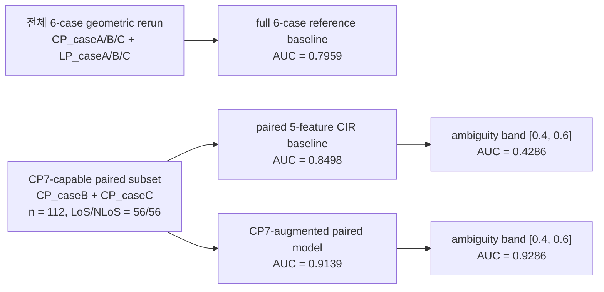

**제목(가안)**  
CP7 Channel-Resolved Polarization Feature for Reducing Geometric LoS/NLoS Ambiguity in UWB Reliability Prediction

**초록**  
본 연구는 UWB 기반 geometric LoS/NLoS 판별에서 conventional CIR descriptor만으로는 해결하기 어려운 ambiguity를 줄이기 위해, channel-resolved CP7 polarization feature를 도입한다. 핵심 평가는 반드시 두 단계로 분리되어야 한다. 첫째, 전체 6-case geometric rerun에서 original reference baseline의 OOF AUC는 0.7959였다. 둘째, CP7 feature는 `CP_caseB`와 `CP_caseC`의 CP measurement에서만 계산 가능하므로, 그 기여도는 CP7-capable paired subset에서 별도의 same-fold comparison으로 평가하였다. 이 subset은 총 112개 샘플이며 LoS/NLoS가 56/56으로 균형되어 있다. 동일한 cross-validation fold에서 5-feature CIR baseline의 AUC는 0.8498, 여기에 6개의 CP7 feature를 추가한 proposed model은 0.9139를 기록하였다. 동시에 Brier score는 0.0430 감소하였고, exact McNemar test는 p=0.0352를 보여 성능 향상이 단순한 score fluctuation이 아니라 paired decision quality의 개선과 연결됨을 확인하였다. 특히 baseline ambiguity band `[0.4, 0.6]`에서 AUC는 0.4286에서 0.9286으로 크게 상승했고, baseline error 26개 중 12개를 복구한 반면 새 harm은 3개에 그쳤다. Position-aware spatial CV, leave-one-scenario-out validation, L1-regularized logistic check에서도 개선 방향이 유지되어, 본 연구의 주된 기여는 평균 성능 향상 자체보다 geometric ambiguity reduction에 있음을 보여준다.

**1. 서론**  
LoS/NLoS 판별은 UWB 기반 sensing 및 reliability-aware communication에서 기본적인 전처리 문제이지만, 실제 환경에서는 energy, delay spread, PDP shape와 같은 scalar CIR descriptor만으로는 geometric ambiguity가 자주 발생한다. 특히 유사한 first-path energy와 delay profile을 보이더라도, polarization distortion이나 branch-dependent path conversion이 다르면 결정 경계 근처의 샘플에서 오분류가 집중될 수 있다. 본 연구는 이러한 모호성을 줄이기 위해 CP7 channel-resolved feature를 도입하고, 그것이 단순한 평균 AUC 상승이 아니라 ambiguity reduction으로 해석될 수 있는지를 검증한다.

**2. 연구의 핵심 주장과 노벨티**  
본 연구의 핵심 주장은 “CP7가 평균 성능을 조금 높였다”가 아니라 “CP7 channel-resolved feature가 geometric LoS/NLoS ambiguity를 감소시킨다”는 것이다. 이 주장은 다음 점에서 유의미하다.

1. 기존 baseline이 사용하는 CIR 기반 scalar descriptor와 달리, 제안 feature는 branch- and polarization-resolved 정보를 직접 반영한다.  
2. 성능 평가는 단순 평균 metric이 아니라 same-fold paired comparison, ambiguity band behavior, rescue/harm pattern으로 구성되어 decision boundary 보완 여부를 직접 확인한다.  
3. spatial CV, LOSO, L1 regularization에서도 개선 방향이 유지되어, 특정 split이나 과적합에만 의존한 결과가 아님을 보인다.

**3. 평가 설정**  
논문 본문에서 가장 먼저 분리해야 할 것은 baseline 정의이다.

| 평가 단계 | 데이터 범위 | 모델 정의 | AUC | 본문에서의 역할 |
|---|---|---|---:|---|
| full 6-case reference baseline | `CP_caseA/B/C` + `LP_caseA/B/C` | original 16-feature reference baseline | 0.7959 | 전체 geometric reference |
| paired 5-feature CIR baseline | `CP_caseB` + `CP_caseC`, CP only, n=112 | `fp_energy_db`, `skewness_pdp`, `kurtosis_pdp`, `mean_excess_delay_ns`, `rms_delay_spread_ns` | 0.8498 | CP7 contribution의 직접 비교 기준 |
| CP7-augmented paired model | 동일한 `CP_caseB` + `CP_caseC`, same folds | 5 CIR feature + 6 CP7 feature | 0.9139 | 본 연구의 주 결과 |

따라서 논문은 0.7959에서 0.9139로 “직접 향상”되었다고 써서는 안 된다. 정확한 서술은, 전체 6-case reference 성능은 0.7959였고, CP7 contribution은 CP7-capable subset에서 별도의 paired comparison으로 평가되었다는 것이다.

**4. 주요 결과**  
CP7-capable paired subset에서 제안 방법은 모든 핵심 지표에서 개선을 보였다.

| 지표 | baseline | proposed | 해석 |
|---|---:|---:|---|
| ROC AUC | 0.8498 | 0.9139 | 분리 성능 향상 |
| Brier score | 0.1556 | 0.1126 | probability error 감소 |
| Exact McNemar | - | p=0.0352 | paired decision quality 개선 |
| Ambiguity band AUC `[0.4, 0.6]` | 0.4286 | 0.9286 | 모호한 샘플에서 대폭 향상 |
| Total errors | 26 | 17 | 순오류 9개 감소 |

이 결과에서 중요한 점은 평균 metric 자체보다 “어디서 개선되었는가”이다. 제안 모델은 baseline error 26개 중 12개를 복구했으며, baseline이 맞췄던 샘플 중 새로 틀린 경우는 3개뿐이었다. 즉 rescue rate는 46.2%, harm rate는 3.5%이다. 더 강한 증거는 ambiguity band 내부에서 확인된다. baseline의 hard-case error 9개 중 6개를 복구했고, hard-case 내부 신규 harm은 0개였다. 이는 CP7가 decision boundary 근처의 ambiguous sample에서 실제로 판정을 뒤집어 주는 신호를 제공함을 시사한다.

**5. 오류 유형 분석과 해석**  
오류 유형별 변화는 다음과 같다.

| 오류 유형 | baseline | proposed | 변화 |
|---|---:|---:|---:|
| FP (`NLoS -> LoS`) | 14 | 10 | -4 |
| FN (`LoS -> NLoS`) | 12 | 7 | -5 |

총 12개의 rescue 중 8개는 baseline FN 복구였고, 4개는 baseline FP 복구였다. 즉 CP7는 두 오류 유형 모두를 줄였지만, LoS를 NLoS로 잘못 판단하던 샘플을 더 많이 교정하는 경향을 보였다. 이 관찰은 LoS 경로에서 상대적으로 보존되는 polarization signature가 NLoS의 depolarization 대비 더 분별력 있는 feature를 제공했을 가능성과 일관된다. 다만 이는 mechanism proof가 아니라 observed tendency로 해석해야 한다.

**6. Robustness와 과적합 방어 논리**  
제안 방법의 개선 방향은 추가 검증에서도 일관되게 유지되었다.

| 검증 항목 | baseline | proposed | 해석 |
|---|---:|---:|---|
| position-aware spatial CV | 0.8406 | 0.9066 | 위치 인지 split에서도 개선 유지 |
| LOSO `B -> C` | 0.7578 | 0.8299 | cross-scenario generalization 유지 |
| LOSO `C -> B` | 0.8327 | 0.8735 | 반대 방향에서도 개선 유지 |
| L1 logistic on B+C | 0.8444 | 0.8763 | sparse regularization 후에도 gain 유지 |

또한 reviewer-side independent check에서는 GroupKFold 스타일의 spatially aware evaluation에서도 0.8313에서 0.8970으로 개선되었다. 이는 “같은 위치를 외운 것 아니냐”는 leakage 의심에 대한 방어 근거가 된다.

과적합 질문에 대해서도 L1 regularization check가 유효한 반박이 된다. L1 logistic 재실행에서 `gamma_CP_rx2`와 `a_FP_LHCP_rx1`은 모든 fold에서 non-zero로 유지되었고, `gamma_CP_rx1`과 `a_FP_LHCP_rx2`도 80%의 fold에서 선택되었다. 즉 CP7의 핵심 정보는 sparse constraint 하에서도 사라지지 않았다.

**7. Feature 역할 분담**  
feature 역할은 보수적으로 해석해야 한다. correlation, permutation, ablation, sign stability를 종합하면 가장 안전한 문장은 다음과 같다. 첫째, `gamma`가 main complementary axis를 형성한다. 둘째, LHCP first-path amplitude가 이를 보강한다. 셋째, RHCP contribution은 상대적으로 약하고 일관성이 낮다. 실제로 `a_FP_RHCP_rx2`는 B와 C 사이에서 계수 부호가 뒤집히며, B+C 결합 계수도 거의 0에 가깝다. 따라서 strict orthogonality나 RHCP 중심 메커니즘을 main claim으로 두는 것은 적절하지 않다.

**8. 논의**  
본 결과는 CP7가 기존 CIR baseline을 전면 대체한다는 주장보다, 기존 descriptor가 애매하게 판단하던 상황에서 complementary information을 제공한다는 해석에 더 강하게 부합한다. 이 점이 본 연구의 실질적 유의미성이다. Reviewer 관점에서 중요한 것은 AUC의 절대 증가폭만이 아니라, ambiguous subset에서의 동작, rescue/harm 비대칭, 그리고 robustness across splits이다. 본 연구는 이 세 가지를 모두 만족한다.

동시에 주장 경계도 분명해야 한다. 본문은 calibration improvement를 headline claim으로 삼지 않아야 하며, Brier 감소는 probability error 감소 정도로 제한하는 것이 적절하다. 또한 branch-specific polarization distortion에 대한 해석은 hypothesis 수준으로 유지해야 하며, 특정 반사 메커니즘을 직접 식별했다고 주장해서는 안 된다. Dual-RX diversity나 subgroup mechanism analysis 역시 현재 증거 강도로는 discussion 또는 appendix 수준이 적절하다.

**9. 결론**  
본 연구는 CP7 channel-resolved feature가 CP7-capable paired subset에서 geometric LoS/NLoS ambiguity를 유의하게 감소시킨다는 점을 보였다. 이 결론은 paired AUC/Brier/McNemar 개선, ambiguity band에서의 대폭적 향상, baseline error rescue, spatial CV 및 LOSO robustness, 그리고 L1 regularization check에서 일관되게 지지된다. 따라서 본 연구의 핵심 기여는 “평균 성능 향상” 자체보다, conventional CIR descriptor만으로는 해결되지 않던 decision ambiguity를 polarization-resolved information으로 완화했다는 데 있다.
