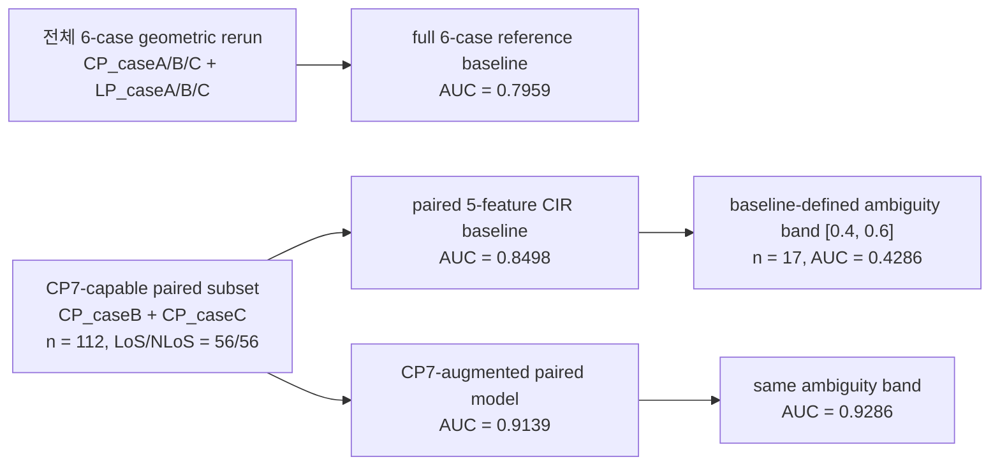
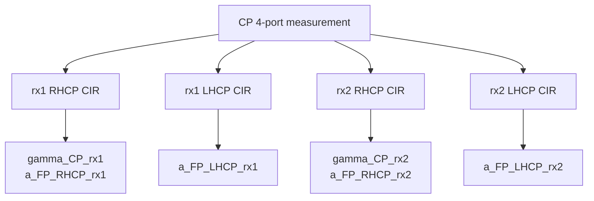

**제목(가안)**  
Reducing Geometric LoS/NLoS Ambiguity in UWB with CP7 Channel-Resolved Polarization Features

**초록**  
본 연구는 UWB 기반 geometric LoS/NLoS 판별에서 conventional scalar CIR descriptor만으로 해결하기 어려운 ambiguity를 줄이기 위해 channel-resolved CP7 polarization features를 도입한다. 전체 6-case geometric rerun에서 16-feature reference baseline의 cross-validated AUC는 0.7959였다. 그러나 CP7 features는 CP-capable subset에서만 정의되므로, 그 증분 기여는 `CP_caseB`+`CP_caseC` subset (`n = 112`, LoS/NLoS = `56/56`)에서 동일한 cross-validation fold를 유지한 paired comparison으로 평가하였다. 이 subset에서 5-feature CIR baseline의 AUC는 `0.8498`이었고, CP7-augmented model은 `0.9139`를 기록하였다. 동시에 Brier score는 `0.0430` 감소하였고, exact McNemar test는 `p = 0.0352`를 보였다. Baseline-defined ambiguity band `[0.4, 0.6]` (`n = 17`)에서는 AUC가 `0.4286`에서 `0.9286`으로 상승하였다. 또한 proposed model은 baseline error 26개 중 12개를 복구한 반면 새 harm은 3개만 추가하였다. Spatially aware validation과 cross-scenario validation에서도 동일한 개선 방향이 유지되었다. 이러한 결과는 CP7의 핵심 기여가 평균 성능 향상 자체보다 decision boundary 근처의 geometric LoS/NLoS ambiguity를 완화하는 데 있음을 보여준다.

**1. 서론**  
LoS/NLoS 판별은 UWB 기반 sensing 및 localization-aware processing에서 기본적인 전처리 문제이지만, 실제 환경에서는 energy, delay spread, PDP shape와 같은 scalar CIR descriptor만으로 geometric ambiguity가 자주 발생한다. 특히 유사한 first-path energy와 delay profile을 보이더라도 polarization distortion이나 branch-dependent path conversion이 다르면, 결정 경계 근처의 샘플에서 오분류가 집중될 수 있다. 본 연구는 이러한 모호성을 줄이기 위해 CP7 channel-resolved features를 도입하고, 그것이 단순한 평균 성능 향상이 아니라 ambiguity reduction으로 해석될 수 있는지를 검증한다.

**2. CP7 Feature 정의**  
본 연구에서 사용하는 CP7 feature는 CP 4-port measurement에서 얻은 두 receiver branch와 두 circular-polarization branch의 CIR로부터 계산된다. 각 샘플에 대해 `rx1`과 `rx2`에서 RHCP/LHCP CIR를 각각 얻고, 여기서 6개의 channel-resolved feature를 구성한다.

| Feature | 정의 | 의미 |
|---|---|---|
| `gamma_CP_rx1` | `log10(r_CP_rx1)` | rx1 branch에서의 RHCP/LHCP first-path power ratio의 로그값 |
| `gamma_CP_rx2` | `log10(r_CP_rx2)` | rx2 branch에서의 RHCP/LHCP first-path power ratio의 로그값 |
| `a_FP_RHCP_rx1` | `E_FP(RHCP, rx1) / E_total(RHCP, rx1)` | rx1 RHCP branch의 normalized first-path energy concentration |
| `a_FP_LHCP_rx1` | `E_FP(LHCP, rx1) / E_total(LHCP, rx1)` | rx1 LHCP branch의 normalized first-path energy concentration |
| `a_FP_RHCP_rx2` | `E_FP(RHCP, rx2) / E_total(RHCP, rx2)` | rx2 RHCP branch의 normalized first-path energy concentration |
| `a_FP_LHCP_rx2` | `E_FP(LHCP, rx2) / E_total(LHCP, rx2)` | rx2 LHCP branch의 normalized first-path energy concentration |

Locked pipeline에서 `r_CP_rxk`는 receiver branch `k`에서 RHCP first-path index를 공통 기준으로 사용하여 계산한 RHCP/LHCP first-path power ratio이며, `gamma_CP_rxk`는 그 값을 로그 변환한 값이다. 또한 `a_FP` 계열은 변수명과 달리 amplitude가 아니라, 선택된 polarization branch CIR에서 first path 주변 에너지의 집중도를 나타내는 normalized first-path energy concentration ratio이다.

이러한 feature는 LoS 경로에서 상대적으로 더 잘 보존될 수 있는 polarization purity와 first-path concentration, 그리고 NLoS 또는 obstruction에서 나타날 수 있는 depolarization 및 delay spreading을 branch별로 반영할 수 있다는 점에서 informative할 가능성이 있다. 다만 이는 feature 설계의 물리적 동기이며, 특정 반사 메커니즘을 직접 식별하는 증거로 해석되지는 않는다.

**3. 평가 설정**  
CP7 feature는 CP-capable subset에서만 정의되므로, 결과는 두 개의 구분된 평가 단계로 제시된다. 첫 번째 단계는 전체 6-case geometric rerun에 대한 broad reference performance를 제시하고, 두 번째 단계는 `CP_caseB`와 `CP_caseC`로 이루어진 paired subset에서 CP7의 incremental contribution을 분리해서 평가한다.

| 평가 단계 | 데이터 범위 | 모델 정의 | AUC | 역할 |
|---|---|---|---:|---|
| Full 6-case reference baseline | `CP_caseA/B/C` + `LP_caseA/B/C` | original 16-feature reference baseline | `0.7959` | broad geometric reference |
| Paired 5-feature CIR baseline | `CP_caseB` + `CP_caseC`, CP only, `n = 112` | `fp_energy_db`, `skewness_pdp`, `kurtosis_pdp`, `mean_excess_delay_ns`, `rms_delay_spread_ns` | `0.8498` | direct comparator for CP7 contribution |
| CP7-augmented paired model | 동일 subset, 동일 preprocessing, 동일 folds | 5 CIR features + 6 CP7 features | `0.9139` | main paired result |

모든 paired comparison은 동일한 5-fold stratified split, training fold에서만 적합한 fold-wise normalization, class-balanced loss를 사용하는 logistic regression, `λ = 1e-2`, decision threshold `0.5`, random seed `42`를 사용하였다.

**4. 주요 결과**  
CP7-capable paired subset에서 CP7-augmented model은 model-wise metric과 pairwise statistic 모두에서 일관된 개선을 보였다.

**4.1 Model-wise metric**

| 지표 | Paired 5-feature CIR baseline | CP7-augmented paired model |
|---|---:|---:|
| ROC AUC | `0.8498` | `0.9139` |
| Brier score | `0.1556` | `0.1126` |
| Total errors | `26` | `17` |

**4.2 Paired comparison statistic**

| 지표 | 값 |
|---|---:|
| `ΔAUC` | `+0.0641` |
| `ΔBrier` | `-0.0430` |
| Exact McNemar `p` | `0.0352` |
| Rescued baseline errors | `12` |
| Newly harmed samples | `3` |
| Rescue rate given baseline error | `0.4615` |
| Harm rate given baseline correct | `0.0349` |

이 결과는 proposed error count가 baseline error 26개 중 12개를 복구하고 3개의 신규 harm을 추가한 결과로 `17`이 되었음을 보여준다. 따라서 개선은 단순한 평균 점수 이동이 아니라, baseline이 잘못 판정한 샘플을 더 많이 복구하는 방향으로 나타났다.

**4.3 Baseline-defined ambiguity band 분석**

Baseline score가 `[0.4, 0.6]`에 위치한 ambiguity band를 기준으로 한 conditional analysis에서도 개선은 더 강하게 나타났다. 이 subset의 표본 수는 `n = 17`이었다.

| 지표 | Paired 5-feature CIR baseline | CP7-augmented paired model |
|---|---:|---:|
| AUC on baseline-defined ambiguity band | `0.4286` | `0.9286` |
| Baseline hard-case errors | `9` | - |
| Rescued hard-case errors | - | `6` |
| Newly harmed hard-case samples | - | `0` |

이 결과는 CP7의 이득이 평균적 성능 향상에만 머무르지 않고, baseline이 불확실했던 샘플에 집중된다는 점을 보여준다.

**5. 오류 유형 분석과 해석**  
오류 유형은 positive class를 LoS로 두고 해석하였다. 이에 따라 아래 표에서 첫 번째 행은 NLoS를 LoS로 잘못 예측한 경우, 두 번째 행은 LoS를 NLoS로 잘못 예측한 경우를 의미한다.

| 오류 유형 | Baseline | Proposed | 변화 |
|---|---:|---:|---:|
| NLoS misclassified as LoS | `14` | `10` | `-4` |
| LoS misclassified as NLoS | `12` | `7` | `-5` |

총 12개의 rescue 중 8개는 LoS를 NLoS로 잘못 예측한 baseline 오류의 복구였고, 4개는 NLoS를 LoS로 잘못 예측한 오류의 복구였다. 즉 CP7는 두 오류 유형 모두를 줄였지만, LoS를 NLoS로 오판하던 샘플에서 더 큰 교정 효과를 보였다. 이 관찰은 LoS 경로에서 상대적으로 더 잘 보존되는 polarization signature가 feature space에서 더 구별 가능한 흔적을 남길 수 있다는 가능한 해석과 일관되지만, 이를 직접 입증하는 것은 아니다.

**6. Robustness**  
개선 방향은 spatially aware validation과 cross-scenario validation에서도 유지되었다.

| 검증 항목 | Baseline | Proposed |
|---|---:|---:|
| Position-aware spatial CV (`leave_one_position_out`) | `0.8406` | `0.9066` |
| LOSO `B -> C` | `0.7578` | `0.8299` |
| LOSO `C -> B` | `0.8327` | `0.8735` |

즉 position-aware split과 cross-scenario transfer 모두에서 개선 방향이 유지되었으며, 이는 제안 feature가 특정 fold 구성이나 특정 scenario에만 의존한 결과가 아님을 시사한다. Additional position-grouped reanalysis와 sparse-regularization stability 결과는 supplementary analysis로 제시할 수 있다.

**7. Feature 역할 분담**  
Across correlation, permutation, ablation, and sign-stability analyses, the gamma pair appears to provide the most complementary axis relative to the baseline, whereas LHCP first-path energy concentration delivers the strongest single-feature contribution. RHCP effects are weaker and less stable across cases.

이 해석은 서로 다른 분석 결과를 동시에 만족한다. `gamma_CP_rx2`는 baseline descriptor와의 redundancy가 가장 낮은 축에 가깝고, repeated ablation에서는 gamma pair 제거 시 성능 저하가 가장 크게 나타났다. 반면 permutation importance에서는 `a_FP_LHCP_rx1`이 가장 큰 단일 feature contribution을 보였다. RHCP 계열은 전체적으로 기여가 약하며, 특히 `a_FP_RHCP_rx2`는 B와 C 사이에서 계수 부호가 뒤집혀 안정성이 낮다.

**8. 논의**  
본 결과는 CP7가 기존 CIR baseline을 전면 대체한다는 주장보다, 기존 descriptor가 애매하게 판단하던 상황에서 complementary information을 제공한다는 해석에 더 강하게 부합한다. Reviewer가 실제로 보게 되는 핵심은 AUC의 절대 증가폭 자체보다, ambiguity band에서의 동작, rescue/harm 비대칭, 그리고 spatially aware 및 cross-scenario validation에서의 일관성이다. 본 결과는 이 세 가지 축에서 모두 일관된 방향을 보였다.

동시에 주장 경계도 분명해야 한다. 본문은 calibration improvement를 headline claim으로 삼지 않아야 하며, Brier 감소는 probability error 감소 정도로 제한하는 것이 적절하다. 또한 branch-specific polarization distortion에 대한 해석은 hypothesis 수준으로 유지해야 하며, 특정 반사 메커니즘을 직접 식별했다고 주장해서는 안 된다. Dual-RX diversity나 subgroup mechanism analysis 역시 현재 증거 강도로는 supplementary discussion 수준이 적절하다.

**9. 결론**  
본 연구는 CP7 channel-resolved polarization features가 CP7-capable paired subset에서 geometric LoS/NLoS ambiguity를 유의하게 감소시킨다는 점을 보였다. 이 결론은 paired AUC/Brier/McNemar 개선, baseline-defined ambiguity band에서의 대폭적 향상, baseline error rescue, 그리고 spatially aware 및 cross-scenario validation에서 일관되게 지지된다. 따라서 본 연구의 핵심 기여는 평균 성능 향상 자체보다, conventional CIR descriptor만으로는 해결되지 않던 decision ambiguity를 polarization-resolved information으로 완화했다는 데 있다.
