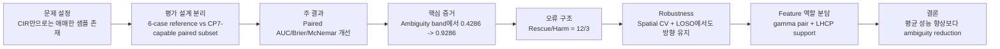
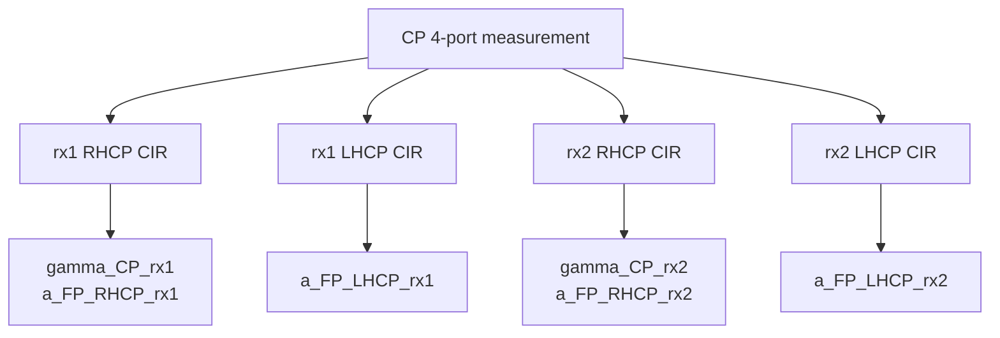
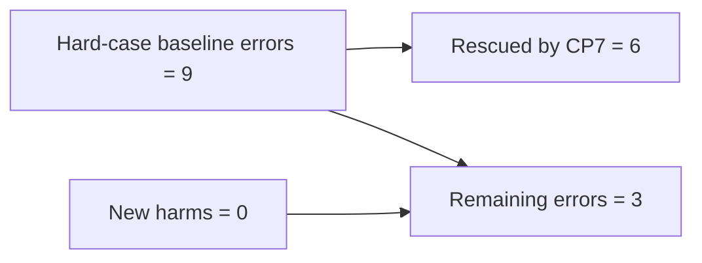

**초안 3: 리뷰어 대응형 구조**

**제목(가안)**  
Reducing Geometric LoS/NLoS Ambiguity in UWB with CP7 Channel-Resolved Polarization Features

**그림 1. 리뷰어가 따라가야 하는 핵심 논리 체인**


**초록**  
본 연구는 UWB 기반 geometric LoS/NLoS 판별에서 conventional scalar CIR descriptor만으로 해결하기 어려운 ambiguity를 줄이기 위해 channel-resolved CP7 polarization features를 도입한다. 전체 6-case geometric rerun에서 16-feature reference baseline의 cross-validated AUC는 `0.7959`였다. 그러나 CP7 feature는 CP-capable subset에서만 정의되므로, 그 증분 기여는 `CP_caseB`+`CP_caseC` subset (`n = 112`, LoS/NLoS = `56/56`)에서 동일한 cross-validation fold를 유지한 paired comparison으로 평가하였다. 이 subset에서 5-feature CIR baseline의 AUC는 `0.8498`이었고, CP7-augmented model은 `0.9139`를 기록하였다. 동시에 Brier score는 `0.0430` 감소하였고, exact McNemar test는 `p = 0.0352`를 보였다. Baseline-defined ambiguity band `[0.4, 0.6]` (`n = 17`)에서는 AUC가 `0.4286`에서 `0.9286`으로 상승하였다. 또한 proposed model은 baseline error 26개 중 12개를 복구한 반면 새 harm은 3개만 추가하였다. Spatially aware validation과 cross-scenario validation에서도 동일한 개선 방향이 유지되었다. 이러한 결과는 CP7의 핵심 기여가 평균 성능 향상 자체보다 decision boundary 근처의 geometric LoS/NLoS ambiguity를 완화하는 데 있음을 보여준다.

---

## 1. 문제 설정과 실용적 동기

**이 절의 논리적 역할**  
리뷰어가 가장 먼저 묻는 질문은 “이 정도 개선이 왜 필요한가”이다. 이 절은 LoS/NLoS 분류가 단순 보조 과제가 아니라, downstream UWB localization 및 reliability-aware processing에서 직접적인 오류 전파 지점이라는 점을 설명한다.

LoS/NLoS 판별은 UWB 기반 sensing과 localization 파이프라인의 전처리 단계이지만, 실제로는 first-path index 선택, direction-of-arrival estimation, 그리고 confidence-aware downstream filtering의 품질에 직접 영향을 준다. 특히 NLoS 샘플을 LoS로 잘못 통과시키거나, LoS 샘플을 obstruction으로 잘못 누르면 first-path 기반 처리에서 systematic bias가 발생할 수 있다. 따라서 이 문제에서 중요한 것은 단순 평균 정확도 향상보다도, baseline이 애매하게 판단하던 샘플을 얼마나 안정적으로 처리하느냐이다.

본 데이터에서 baseline-defined ambiguity band `[0.4, 0.6]`에 속한 샘플은 `17/112`, 즉 약 `15.2%`이다. 비율 자체는 크지 않지만, 이 샘플들은 모델 confidence가 낮거나 방향이 틀어진 상태에서 decision boundary 근처에 몰려 있기 때문에 downstream 파이프라인의 worst-case failure를 유발하기 쉽다. 따라서 이 논문의 핵심 평가는 전체 평균 성능보다 ambiguity band에서의 동작에 맞춰져야 한다.

**그림 2. 전체 paired 성능과 ambiguity band 성능의 대비**

```mermaid
xychart-beta
    title "전체 평균 개선과 ambiguity band 개선의 대비"
    x-axis ["Paired Overall", "Ambiguity Band"]
    y-axis "AUC" 0 --> 1.0
    bar [0.8498, 0.4286]
    bar [0.9139, 0.9286]
```


---

## 2. CP7 Feature 정의와 물리적 동기

**이 절의 논리적 역할**  
리뷰어가 “gamma_CP란 무엇인가”, “CP7가 실제로 무엇을 측정하는가”를 묻기 전에 feature 정의를 선행적으로 제시하여 논리적 공백을 막는다.

본 연구에서 사용하는 CP7 feature는 CP 4-port measurement에서 얻은 두 receiver branch와 두 circular-polarization branch의 CIR로부터 계산된다. 각 샘플에 대해 `rx1`과 `rx2`에서 RHCP/LHCP CIR를 각각 얻고, 다음 6개의 channel-resolved feature를 구성한다.



| Feature | 정의 | 의미 |
|---|---|---|
| `gamma_CP_rx1` | `log10(r_CP_rx1)` | rx1 branch의 RHCP/LHCP first-path power ratio의 로그값 |
| `gamma_CP_rx2` | `log10(r_CP_rx2)` | rx2 branch의 RHCP/LHCP first-path power ratio의 로그값 |
| `a_FP_RHCP_rx1` | `E_FP(RHCP, rx1) / E_total(RHCP, rx1)` | rx1 RHCP branch의 normalized first-path energy concentration |
| `a_FP_LHCP_rx1` | `E_FP(LHCP, rx1) / E_total(LHCP, rx1)` | rx1 LHCP branch의 normalized first-path energy concentration |
| `a_FP_RHCP_rx2` | `E_FP(RHCP, rx2) / E_total(RHCP, rx2)` | rx2 RHCP branch의 normalized first-path energy concentration |
| `a_FP_LHCP_rx2` | `E_FP(LHCP, rx2) / E_total(LHCP, rx2)` | rx2 LHCP branch의 normalized first-path energy concentration |

여기서 `r_CP_rxk`는 receiver branch `k`에서 RHCP first-path index를 공통 기준으로 사용하여 계산한 RHCP/LHCP first-path power ratio이며, `gamma_CP_rxk`는 그 값을 로그 변환한 값이다. 또한 `a_FP` 계열은 변수명과 달리 amplitude가 아니라, 선택된 polarization branch CIR에서 first-path 주변 에너지의 집중도를 나타내는 normalized first-path energy concentration ratio이다.

이 feature 설계의 물리적 동기는 비교적 단순하다. LoS 경로에서는 polarization purity와 first-path concentration이 상대적으로 더 보존될 수 있는 반면, NLoS 또는 obstruction이 증가하면 depolarization과 delay spreading이 커질 수 있다. 따라서 receiver branch별 `gamma_CP`와 `a_FP` 패턴은 conventional CIR descriptor가 놓치는 보완 정보를 제공할 가능성이 있다. 다만 이 해석은 feature 설계의 물리적 동기이며, 특정 반사 메커니즘을 직접 식별했다는 의미는 아니다.

---

## 3. 평가 설계: 왜 subset을 분리해서 보는가

**이 절의 논리적 역할**  
리뷰어가 가장 먼저 의심하는 부분은 “왜 전체 6-case 결과와 subset 결과를 따로 쓰는가”이다. 이 절은 baseline 정의와 측정 대상을 분리하여, `0.7959`와 `0.8498`가 서로 다른 evaluation universe에 속한다는 점을 명확히 한다.

CP7 feature는 CP-capable subset에서만 정의되므로, 결과는 두 개의 구분된 평가 단계로 제시된다. 첫 번째 단계는 전체 6-case geometric rerun에 대한 broad reference performance를 제시하고, 두 번째 단계는 `CP_caseB`와 `CP_caseC`로 이루어진 paired subset에서 CP7의 incremental contribution만을 분리해서 평가한다. 따라서 full 6-case reference baseline의 AUC `0.7959`와 paired 5-feature CIR baseline의 AUC `0.8498`는 동일한 선상에서 비교되는 숫자가 아니다.

| 평가 단계 | 데이터 범위 | 모델 정의 | AUC | 역할 |
|---|---|---|---:|---|
| Full 6-case reference baseline | `CP_caseA/B/C` + `LP_caseA/B/C` | original 16-feature reference baseline | `0.7959` | broad geometric reference |
| Paired 5-feature CIR baseline | `CP_caseB` + `CP_caseC`, CP only, `n = 112` | `fp_energy_db`, `skewness_pdp`, `kurtosis_pdp`, `mean_excess_delay_ns`, `rms_delay_spread_ns` | `0.8498` | direct comparator for CP7 contribution |
| CP7-augmented paired model | 동일 subset, 동일 preprocessing, 동일 folds | 5 CIR features + 6 CP7 features | `0.9139` | main paired result |

All paired comparisons used identical 5-fold stratified splits, fold-wise normalization fitted on the training folds only, logistic regression with class-balanced loss, `λ = 1e-2`, decision threshold `0.5`, and random seed `42`.

이 설계의 핵심은 단순하다. 6-case reference는 전체 geometric pipeline의 broad reference를 제공하고, paired B+C comparison은 CP7의 incremental contribution만을 공정하게 고립시킨다.

---

## 4. 주 결과: CP7는 평균 성능보다 ambiguity reduction에서 더 강하게 드러난다

**이 절의 논리적 역할**  
전체 paired 개선을 먼저 보여 주되, 리뷰어가 “개선 폭이 크지 않다”고 읽지 않도록 곧바로 ambiguity band와 rescue/harm 구조로 연결한다.

### 4.1 Model-wise metric

| 지표 | Paired 5-feature CIR baseline | CP7-augmented paired model |
|---|---:|---:|
| ROC AUC | `0.8498` | `0.9139` |
| Brier score | `0.1556` | `0.1126` |
| Total errors | `26` | `17` |

### 4.2 Pairwise statistic

| 지표 | 값 |
|---|---:|
| `ΔAUC` | `+0.0641` |
| `ΔBrier` | `-0.0430` |
| Exact McNemar `p` | `0.0352` |
| Rescued baseline errors | `12` |
| Newly harmed samples | `3` |
| Rescue rate given baseline error | `0.4615` |
| Harm rate given baseline correct | `0.0349` |

전체 paired subset에서의 `ΔAUC = +0.0641`은 단독으로 보면 moderate improvement로 읽힐 수 있다. 그러나 이 숫자만으로는 CP7의 실제 효과가 과소평가된다. 이유는 baseline이 이미 잘 처리하는 다수의 쉬운 샘플에서는 두 모델 모두 높은 성능을 유지하는 반면, CP7의 주된 이득은 baseline이 판단을 포기하거나 방향을 잘못 잡는 소수의 ambiguous sample에 집중되기 때문이다.

---

## 5. Ambiguity band 분석: 이 논문의 핵심 실증 증거

**이 절의 논리적 역할**  
리뷰어 관점에서 이 절이 §1의 문제 설정과 §10의 결론을 연결하는 핵심 증거이다. 평균 성능 향상이 modest해 보여도, ambiguity band에서의 대폭 개선이 main claim을 실질적으로 지지한다.

Baseline score가 `[0.4, 0.6]`에 위치한 baseline-defined ambiguity band를 기준으로 한 conditional analysis에서는 CP7의 이득이 훨씬 더 강하게 나타났다. 이 subset의 표본 수는 `n = 17`이었다.

| 측정 대상 | Baseline | Proposed | 해석 |
|---|---:|---:|---|
| 전체 paired subset (`n = 112`) | `0.8498` | `0.9139` | `+0.0641`, moderate |
| **Baseline-defined ambiguity band (`n = 17`)** | **`0.4286`** | **`0.9286`** | **`+0.5000`, dramatic** |
| Error count | `26` | `17` | `-9`, rescue/harm = `12/3` |

이 결과는 다음과 같이 읽는 것이 정확하다. 전체 AUC 향상은 moderate하지만, ambiguity band 내 AUC 향상은 dramatic하다. 다시 말해 CP7의 이득은 전체 샘플에 균등하게 퍼진 것이 아니라, baseline이 애매하게 판단하거나 방향을 잘못 잡은 샘플에 집중되어 있다.

### 5.1 AUC = 0.4286이 의미하는 것

AUC는 다음 확률로 해석할 수 있다.

> `AUC = P(분류기가 임의의 LoS 샘플에 임의의 NLoS 샘플보다 더 높은 LoS score를 줄 확률)`

이 정의에 따르면:

| AUC | 의미 |
|---|---|
| `1.0` | 완벽한 분리 |
| `0.5` | 무작위와 동일 |
| `0.4286` | 무작위보다 체계적으로 나쁨 |
| `0.0` | 완전히 반대로 분류 |

즉 ambiguity band 안에서 baseline model은 단순히 “모른다” 수준에 머무는 것이 아니라, LoS와 NLoS에 대해 잘못된 방향의 ranking을 만들고 있다. 이 구간에서 CP7가 AUC를 `0.9286`으로 복구했다는 점은, 제안 feature가 genuinely complementary한 축을 추가하고 있음을 보여주는 가장 직접적인 증거이다.

### 5.2 Hard-case rescue 구조

| 지표 | 값 |
|---|---:|
| Hard-case baseline errors | `9` |
| Rescued hard-case errors | `6` |
| Newly harmed hard-case samples | `0` |

**그림 3. Ambiguity band 내부 복구 구조**


이 결과는 CP7의 효과가 “평균 성능이 조금 올랐다”가 아니라, baseline이 실제로 혼동하는 샘플에서 decision을 복구했다는 쪽에 있음을 보여준다.

---

## 6. 왜 이 개선이 실질적으로 중요한가

**이 절의 논리적 역할**  
리뷰어가 “이 정도 개선이 필요한가?”라고 묻는 지점에 답한다. 핵심은 전체 평균보다 ambiguity band가 downstream failure와 더 직접적으로 연결된다는 점이다.

전체 측정 포인트 중 ambiguity band 샘플은 약 `15%`에 불과하지만, 이 샘플들이야말로 confidence score가 `0.4~0.6` 범위에 걸쳐 있어 naive threshold `0.5`에서 거의 동전 던지기 수준으로 처리될 가능성이 높은 샘플이다. 더 중요한 것은, baseline의 ambiguity band AUC가 `0.4286`이라는 점이다. 이는 단순히 불확실한 것이 아니라, 이 구간에서 baseline feature가 체계적으로 잘못된 ranking signal을 제공하고 있음을 의미한다.

따라서 CP7가 이 구간을 `0.9286`으로 복구하는 것은 전체 AUC `+0.0641`보다 훨씬 큰 실질적 의미를 가진다. 실제로 전체 error는 `26 -> 17`로 줄었고, 그 과정은 `12` rescue와 `3` harm이라는 비대칭 구조로 나타났다. 이는 baseline이 이미 처리 가능한 쉬운 샘플에서의 작은 개선이 아니라, worst-case failure를 줄이는 방향의 개선이다.

---

## 7. 통계적 검정: McNemar가 실제로 보여주는 것

**이 절의 논리적 역할**  
리뷰어가 McNemar `p = 0.0352`를 “성능 향상 유의성”으로 오해하지 않도록, 이 검정이 무엇을 검정하는지 분명히 설명한다.

McNemar test는 같은 샘플 집합에 대해 두 분류기가 **서로 다른 오류 패턴**을 보이는지를 검정한다. 사용되는 2×2 표는 다음과 같다.

|  | Proposed 정답 | Proposed 오류 |
|---|---:|---:|
| Baseline 정답 | `a = 83` | `b = 3` |
| Baseline 오류 | `c = 12` | `d = 14` |

여기서 McNemar가 실제로 보는 것은 `b`와 `c`의 차이뿐이다. 본 결과에서:

- `b = 3`: baseline만 맞고 proposed는 틀린 경우, 즉 newly harmed  
- `c = 12`: proposed만 맞고 baseline은 틀린 경우, 즉 rescued  

귀무가설은 `b = c`, 즉 두 모델의 오류 패턴 차이가 없다는 것이다. 본 연구에서는 `b + c = 15`로 표본 수가 작기 때문에 카이제곱 근사 대신 exact McNemar를 사용하는 것이 맞으며, 결과는 `p = 0.0352`였다.

이 p-value는 “proposed model이 baseline보다 무조건 더 좋다”를 직접 검정하는 것이 아니라, **CP7가 baseline과 다른 샘플을 맞히고 있으며 그 비대칭이 우연으로 보기 어렵다**는 점을 지지한다. 즉 McNemar는 CP7가 baseline과 독립적인 보완 정보를 제공한다는 주장을 뒷받침하는 paired decision-quality 검정으로 읽는 것이 가장 정확하다.

---

## 8. Robustness: 이 결과가 우연한 fold 구성 때문이 아님을 보이는 근거

**이 절의 논리적 역할**  
Rescue/harm 비대칭이 특정 split에서 우연히 생긴 현상이 아니라는 점을 보인다. Spatial CV와 LOSO 두 축이 이 절의 핵심이다.

개선 방향은 spatially aware validation과 cross-scenario validation에서도 유지되었다.

| 검증 항목 | Baseline | Proposed |
|---|---:|---:|
| Position-aware spatial CV (`leave_one_position_out`) | `0.8406` | `0.9066` |
| LOSO `B -> C` | `0.7578` | `0.8299` |
| LOSO `C -> B` | `0.8327` | `0.8735` |

이 결과는 두 가지 점에서 중요하다.

1. Position-aware split에서도 개선 방향이 유지되므로, 결과가 단순 위치 memorization에 기대고 있다고 보기 어렵다.  
2. LOSO의 양 방향(`B -> C`, `C -> B`) 모두에서 개선이 유지되므로, 특정 scenario에만 맞춘 overfitting으로 보기 어렵다.

Supplementary analysis로는 GroupKFold-style position-grouped reanalysis와 L1 regularization stability check를 둘 수 있다. 그러나 main text에서 핵심은 “spatially aware and cross-scenario validation 모두에서 improvement direction이 유지되었다”는 점이다.

---

## 9. Feature 역할 분담: 네 가지 분석이 각각 무엇을 확인하는가

**이 절의 논리적 역할**  
리뷰어가 “어떤 feature가 실제로 도움을 주는가”, “gamma와 LHCP가 왜 동시에 중요하다고 하나”, “RHCP는 왜 중심 claim이 아닌가”를 물을 때 답하는 절이다.

### 9.1 Correlation with baseline features

**목적**  
CP7 feature가 기존 5-feature CIR baseline의 중복인지, 아니면 새로운 정보 축인지 확인한다.

**방법**  
각 CP7 feature와 baseline feature 간의 Pearson/Spearman 상관을 계산한다.

**결과**

| Feature | max abs Pearson vs baseline | max abs Spearman vs baseline | 해석 |
|---|---:|---:|---|
| `gamma_CP_rx2` | `0.3243` | `0.3540` | 가장 complementary한 축 |
| `gamma_CP_rx1` | `0.4085` | `0.3929` | 비교적 낮은 redundancy |
| `a_FP_LHCP_rx2` | `0.4375` | `0.5326` | 부분 중복 |
| `a_FP_LHCP_rx1` | `0.4574` | `0.5724` | 부분 중복 |
| `a_FP_RHCP_rx2` | `0.6442` | `0.5924` | 높은 redundancy |
| `a_FP_RHCP_rx1` | `0.6579` | `0.5418` | 높은 redundancy |

이 분석은 `gamma` pair, 특히 `gamma_CP_rx2`가 baseline과 가장 다른 정보 축을 제공한다는 점을 보여준다.

### 9.2 Permutation Importance

**목적**  
훈련된 모델에서 각 feature의 marginal contribution을 측정한다.

**방법**  
훈련된 모델을 고정한 채 test fold에서 특정 feature만 무작위로 섞고, AUC 저하를 측정한다.

**결과**

| Feature | Logistic permutation mean AUC drop |
|---|---:|
| `a_FP_LHCP_rx1` | `0.0713` |
| `gamma_CP_rx2` | `0.0388` |
| `a_FP_RHCP_rx1` | `0.0129` |
| `gamma_CP_rx1` | `0.0085` |
| `a_FP_LHCP_rx2` | `0.0029` |
| `a_FP_RHCP_rx2` | `-0.0016` |

이 결과는 단일 feature 기준으로는 `a_FP_LHCP_rx1`이 가장 큰 기여를 한다는 점을 보여준다.

### 9.3 Repeated Ablation

**목적**  
Feature 그룹을 완전히 제거한 상태에서 재학습했을 때의 손실을 측정한다.

**방법**  
Feature 또는 feature group을 제거한 상태에서 동일한 stratified 5-fold CV를 20회 반복해 재학습한다.

**B+C 평균 결과**

| Variant | AUC | `ΔAUC` vs full proposed |
|---|---:|---:|
| Full proposed | `0.9059` | `0` |
| Drop gamma pair | `0.8787` | `-0.0272` |
| Drop LHCP pair | `0.8893` | `-0.0165` |
| Drop RHCP pair | `0.9040` | `-0.0019` |

이 결과는 gamma pair를 동시에 제거했을 때 손실이 가장 크며, LHCP pair가 그다음이고, RHCP pair는 영향이 거의 없음을 보여준다.

### 9.4 Sign-Stability Analysis

**목적**  
Feature의 logistic coefficient 부호가 case B와 case C에서 일관적인지 확인한다.

**결과**

| Feature | Case B | Case C | B+C | 해석 |
|---|---|---|---|---|
| `gamma_CP_rx1` | `+` | `+` | `+` | 안정 |
| `gamma_CP_rx2` | `-` | `-` | `-` | 안정 |
| `a_FP_LHCP_rx1` | `+` | `+` | `+` | 안정 |
| `a_FP_LHCP_rx2` | `+` | `+` | `+` | 안정 |
| `a_FP_RHCP_rx1` | `-` | `-` | `-` | 안정하지만 약함 |
| `a_FP_RHCP_rx2` | `-` | `+` | `+` | 부호 반전, 불안정 |

`a_FP_RHCP_rx2`의 부호 반전은 RHCP branch가 시나리오 구조에 따라 민감하게 달라질 수 있음을 시사하며, 이 때문에 RHCP 계열을 main claim의 중심에 두기는 어렵다.

### 9.5 네 분석의 종합

이 네 분석은 서로 모순되지 않는다. 오히려 다음과 같이 역할을 나눠서 읽는 것이 가장 자연스럽다.

```text
gamma pair      -> baseline 대비 가장 complementary한 정보 축
LHCP a_FP pair  -> 단일 feature 수준에서 가장 강한 기여
RHCP branch     -> 상대적으로 약하고 시나리오 의존적
```

즉, gamma pair는 baseline과 중복되지 않는 새로운 축을 제공하고, LHCP first-path energy concentration은 실제 decision에서 가장 강한 단일 signal을 제공한다. RHCP 효과는 보조적이며 덜 안정적이다.

---

## 10. 주장 경계와 논의

**이 절의 논리적 역할**  
무엇을 주장하고 무엇을 주장하지 않는지를 분명히 하여 reviewer 신뢰를 높인다.

본 연구의 중심 claim은 “CP7가 평균 성능을 조금 올렸다”가 아니라 “CP7가 geometric LoS/NLoS ambiguity를 감소시킨다”이다. 이 claim은 paired AUC/Brier/McNemar 개선, ambiguity band에서의 dramatic improvement, rescue/harm 비대칭, spatial CV와 LOSO robustness, 그리고 feature 역할 분담 분석에 의해 지지된다.

반면 다음과 같은 주장은 main text headline으로 두지 않는 것이 적절하다.

- calibration improvement를 핵심 기여로 두는 해석  
- strict orthogonality를 주장하는 해석  
- branch-specific polarization mechanism을 직접 입증했다는 해석  
- dual-RX diversity가 항상 유의미하다는 주장  
- subgroup mechanism analysis를 강한 메커니즘 증거로 사용하는 해석

이러한 claim boundary는 결과를 약하게 만드는 것이 아니라, 오히려 논문의 신뢰도를 높이는 장치다.

---

## 11. 결론

본 연구는 CP7 channel-resolved polarization feature가 CP7-capable paired subset에서 geometric LoS/NLoS ambiguity를 유의하게 감소시킨다는 점을 보였다. 전체 paired subset에서의 개선은 `0.8498 -> 0.9139`였지만, 이보다 더 중요한 증거는 baseline-defined ambiguity band에서의 `0.4286 -> 0.9286` 개선과 `12` rescue 대 `3` harm의 비대칭 구조이다. Spatially aware validation과 cross-scenario validation에서도 동일한 방향이 유지되었으며, feature 분해 분석은 gamma pair와 LHCP branch가 핵심 complementary information을 제공함을 보여주었다. 따라서 본 연구의 주요 기여는 평균 accuracy 향상 자체보다, conventional CIR descriptor만으로는 해결되지 않던 decision ambiguity를 polarization-resolved information으로 완화했다는 데 있다.
